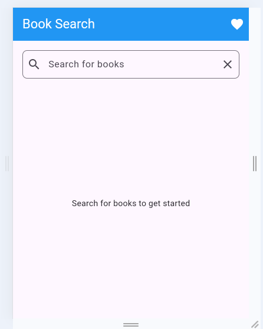
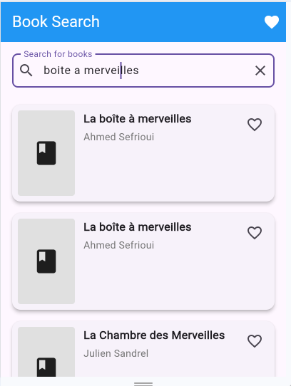
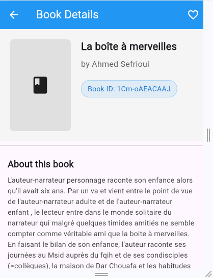
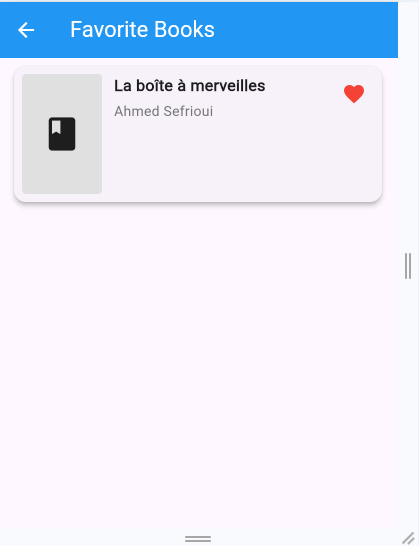
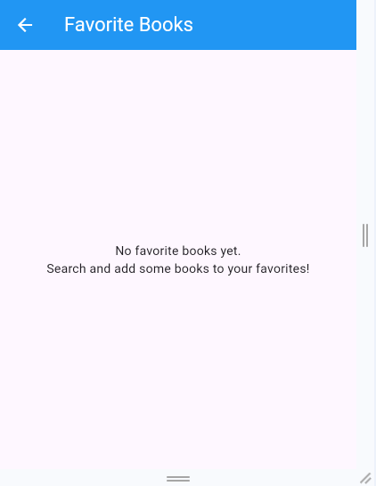

# Book Manager App

## Overview

Book Manager App is a feature-rich Flutter application that allows users to search for books using the Google Books API, view detailed information about each book, and save their favorite titles for future reference. This application demonstrates modern Flutter development practices including state management with BLoC pattern and clean architecture principles.


*The home screen with search functionality*

## Features

- **Book Search**: Search for books by title, author, or keyword
  
  
  *Search results showing matching books*

- **Detailed Book Information**: View comprehensive details about each book including:
  - Cover image
  - Title and author
  - Description
  - Book ID
  
  
  *Detailed view of a selected book with its information*

- **Favorites Management**: Add books to favorites and access them offline
  
  
  *Favorites screen showing saved books*
  
  
  *Empty favorites screen with prompt to add books*

- **Responsive UI**: Clean and intuitive interface that works across different device sizes

## Architecture

This project follows a structured architecture pattern:

- **Data Layer**: Repositories and data models
- **Business Logic Layer**: BLoC pattern for state management
- **Presentation Layer**: UI components built with Flutter widgets

### Key Components

- **BLoC Pattern**: Separates business logic from UI for better testability and maintenance
- **Repository Pattern**: Abstracts data sources and provides clean API for the application
- **Equatable**: Used for efficient object comparison

## Technical Stack

- **Flutter**: UI framework
- **flutter_bloc**: State management
- **http**: Network requests
- **sqflite**: Local database for favorites storage
- **shared_preferences**: Persistent light storage
- **cached_network_image**: Efficient image loading and caching

## Getting Started

### Prerequisites

- Flutter SDK (version 3.0.0 or higher)
- Dart SDK (compatible with your Flutter version)
- Android Studio / VS Code with Flutter plugins
- An emulator or physical device for testing

### Installation

1. Clone this repository:
```
git clone https://github.com/yourusername/book_manager_app.git
```

2. Navigate to the project directory:
```
cd book_manager_app
```

3. Install dependencies:
```
flutter pub get
```

4. Run the app:
```
flutter run
```

## Project Structure

```
lib/
├── bloc/                 # BLoC state management
│   ├── book_search/      # Book search feature
│   └── favorites/        # Favorites management feature
├── data/                 # Data layer
│   ├── models/           # Data models
│   └── repositories/     # Data repositories
├── ui/                   # Presentation layer
│   ├── pages/            # App screens
│   └── widgets/          # Reusable UI components
└── main.dart             # App entry point
```

## Customization

You can customize various aspects of the app:

- **Theme**: Modify the theme in `main.dart` to change colors and styles
- **App Name**: Update the app name in platform-specific files and manifests
- **Icons**: Replace the default Flutter icons with your own

## Contributing

Contributions to improve the Book Manager App are welcome. Please follow these steps:

1. Fork the repository
2. Create a feature branch (`git checkout -b feature/amazing-feature`)
3. Commit your changes (`git commit -m 'Add some amazing feature'`)
4. Push to the branch (`git push origin feature/amazing-feature`)
5. Open a Pull Request

## License

This project is licensed under the MIT License - see the LICENSE file for details.

## Acknowledgments

- Flutter team for the amazing framework
- Google Books API for providing book data
- All open-source packages used in this project

---

*Note: Make sure to place the screenshots in an assets/images folder in your project directory.*
